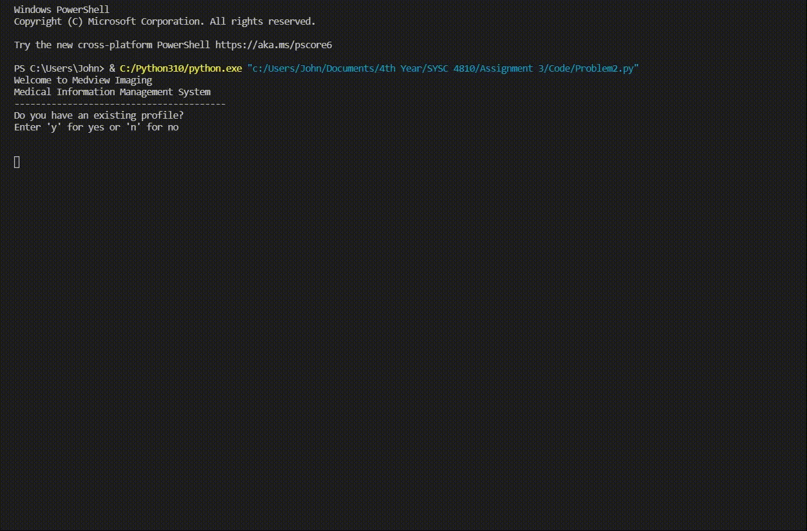

# Access-Control-Mechanism
## This program acts as a system which allows employees of Medview Imaging to log into an exisiting profile or create a new profile. User info is stored in .txt files which act as the database for the program and passwords are securely hashed in the database using Bcrypt algorithm.

To test this program, simply run the AccessControlMechanism.py file using any IDE of your preference which supports Python 3 or up.

